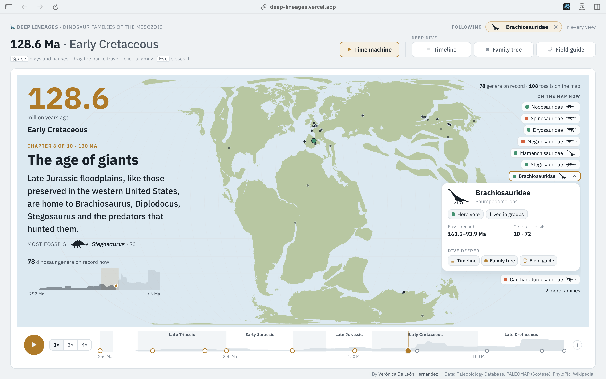
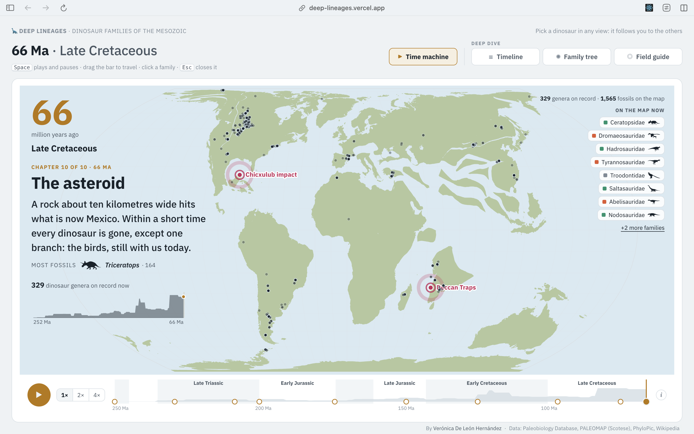
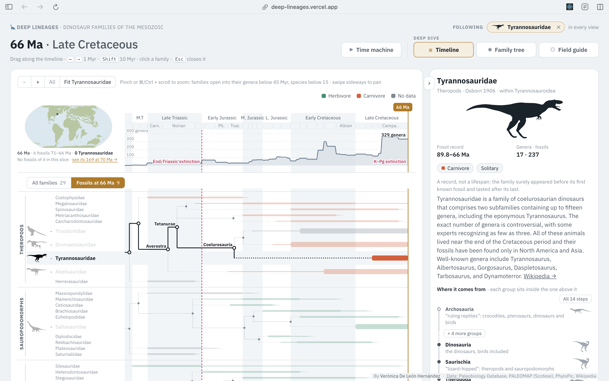
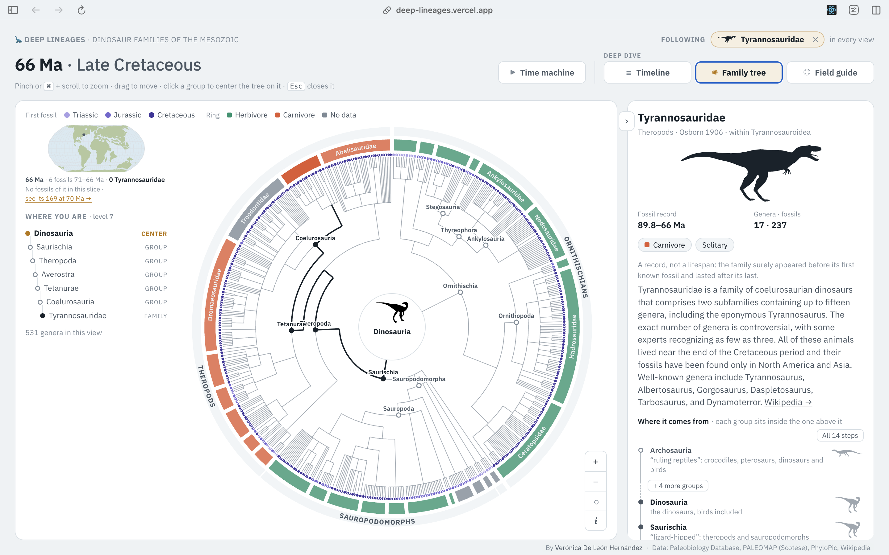
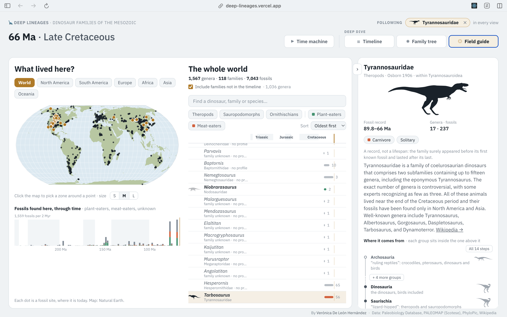

# 🦕 Deep Lineages

*186 million years of dinosaurs, on maps of the world as it was.*

I read Steve Brusatte's *The Rise and Fall of the Dinosaurs* and kept wanting to **see** it: who lived when, who
was related to whom, and where on Earth (on the Earth of back then) their bones turned up. So I built that. It's
a small, very personal data project that turned into a playful app: 29 dinosaur families, 531 genera and
7,043 real fossils from the Paleobiology Database.

**👉 Try it: [deep-lineages.vercel.app](https://deep-lineages.vercel.app)**

<!-- 📸 SCREENSHOT (hero): the welcome screen, or the time machine mid-journey (e.g. 150 Ma, "The age of giants").
     Save as docs/screenshots/hero.png and uncomment:

-->

---

## What's inside

There are four ways in. Whatever you pick in one (a moment in time, a family, a genus) comes with you to the next.

### ▶ Time machine

Press play and travel from the Great Dying (252 Ma) to the asteroid (66 Ma). The continents drift, fossils pop up
where they were buried, and the story is told in ten short chapters, like a little documentary. Each chapter
shows big events pulsing on the map (Siberian Traps, Chicxulub…), a mini chart of how many genera were around,
and the dinosaur with the most fossils in that stretch of time. While it plays, everything else fades back:
cinema mode.

<!-- 📸 SCREENSHOT: time machine at 66 Ma with Chicxulub and the Deccan Traps pulsing.
     Save as docs/screenshots/time-machine.png and uncomment:

-->

### ☰ Timeline

When each family lived, with its family tree drawn right into the timeline. Zoom in with the trackpad and
families open into their genera, then species. Bars show where most of the fossils are, a thin line shows the
full record, and a fade after the last fossil reminds you that a family didn't vanish the day its last known bone
was buried.

<!-- 📸 SCREENSHOT: timeline with Tyrannosauridae selected and its lineage lit up.
     Save as docs/screenshots/timeline.png and uncomment:

-->

### ✺ Family tree

The whole tree as a round poster: Dinosauria in the middle, every genus on the rim, rings for families (in their
diet color) and the three big lineages. Pinch to zoom. A "Where you are" guide on the side shows how deep you
are, from Dinosauria all the way down to a single species.

<!-- 📸 SCREENSHOT: family tree with Tyrannosaurus selected and the "Where you are" ladder visible.
     Save as docs/screenshots/family-tree.png and uncomment:

-->

### ◎ Field guide: "What lived here?"

Pick a continent or click anywhere on today's map to draw a zone (S, M or L) and see which dinosaurs were found
there, and when. Hover a name to light up its sites. The search box autocompletes, because nobody can spell
*Mamenchisaurus* on the first try.

<!-- 📸 SCREENSHOT: field guide with a zone drawn over Montana/Alberta and the list next to it.
     Save as docs/screenshots/field-guide.png and uncomment:

-->

---

## Run it locally

You need Node 20+ (and Python 3 only if you want to rebuild the data).

```bash
cd app
npm install
npm run dev        # http://localhost:5173
```

`npm run build` type-checks and builds into `app/dist/`. The processed data is already in the repo, so the app
works out of the box.

---

## Under the hood

**App:** React + TypeScript + Vite, D3 for scales, shapes and map projections, CSS Modules. No backend: it's all
static files. Vite serves `data/processed/` as the app's public folder, so the app and the data pipeline share
one copy of the data.

**Data pipeline:** a few Python scripts that download, clean and enrich the data. Every API response is cached
in `data/raw/api_cache/`, so re-runs only fetch what's new.

```bash
python3 -m venv .venv
.venv/bin/pip install -r requirements.txt

# get the fossil occurrences from the PBDB
curl -o data/raw/dinos_pbdb.csv "https://paleobiodb.org/data1.2/occs/list.csv?base_name=Dinosauria&interval=Triassic,Cretaceous&idreso=genus&show=coords,paleoloc,class,loc"

# then, from the project root, in this order
.venv/bin/python scripts/build_families.py      # which families, + PhyloPic & Wikipedia
.venv/bin/python scripts/build_genera.py        # their genera, species and ancestry
.venv/bin/python scripts/build_clades.py        # silhouettes for the groups in the tree
.venv/bin/python scripts/build_relatives.py     # close relatives outside the chosen families
.venv/bin/python scripts/build_timeline.py      # fossils, diversity, periods and stages
.venv/bin/python scripts/build_paleomaps.py     # coastlines every 10 Myr (GPlates)
```

<details>
<summary>What each script does (the nerdy details)</summary>

- **`build_families.py` → `families.json`.** For each period, the 2 families with the most genera in each
  lineage (theropods, sauropodomorphs, ornithischians; birds excluded; at least 3 genera in that period), plus a
  few iconic ones (`ALWAYS`), minus doubtful ones (`EXCLUDE`). Footprints and eggs are left out. Enriched with
  the PBDB (diet, life habit), PhyloPic (silhouette, author, license) and Wikipedia.
- **`build_genera.py` → `genera.json`.** Genera and species of each family, their ancestry from Archosauria down,
  subfamilies and tribes, who named each one, a Wikipedia summary and a silhouette. A genus keeps a PhyloPic
  silhouette only if the image really is that genus; otherwise the app borrows the family's (shown fainter).
- **`build_clades.py` → `clades.json`, `silhouettes/clades/`.** A silhouette for each group along the ancestry
  paths.
- **`build_relatives.py` → `relatives.json`.** Close relatives that no chosen family covers (e.g. early
  tyrannosauroids like *Guanlong* or *Yutyrannus*), so a lineage's early history has evidence and not just a
  dotted line.
- **`build_timeline.py` → `fossils.json`, `diversity.json`, `periods.json`, `stages.json`.** Body fossils for the
  maps, genus diversity per million years, and the periods and ICS stages the PBDB uses.
- **`build_paleomaps.py` → `paleomap/`.** Coastlines and fossil sites reconstructed every 10 million years with
  the PALEOMAP model. Heads-up: these are today's coastlines moved to where they were, not the actual coastlines
  of the time (so no inland seas).

</details>

<details>
<summary>Project structure</summary>

```
app/                 the app (React + TypeScript + Vite)
  src/components/    TimeMachine, Timeline, TreeView, FieldGuide, FamilyPanel, Welcome…
  src/story.ts       the time machine's ten chapters
  src/assets/        today's land (Natural Earth) for the field guide
data/raw/            downloaded data, untouched (+ api_cache/)
data/processed/      app-ready data: families, genera, fossils, paleomaps, silhouettes
scripts/             the data pipeline
notebooks/           exploration
prototype/           the very first version (plain HTML + D3), kept for nostalgia
```

</details>

---

## A few honest caveats

- **A fossil record isn't a lifespan.** Families surely appeared before their first known fossil and lasted
  after their last. The fades in the timeline are there to remind you.
- **The record is biased.** Big animals with sturdy bones, living where sediments piled up, fossilize much
  better. That's why a genus known almost only from teeth (*Richardoestesia*) can "win" a chapter.
- **The maps are approximate.** Continents jump every 10 million years (with a crossfade in between), and the
  positions of the events on the map are estimated from nearby fossil sites.

---

## Credits

- Fossil data: [Paleobiology Database](https://paleobiodb.org) (CC BY 4.0)
- Paleogeography: [GPlates Web Service](https://gwsdoc.gplates.org), PALEOMAP model by C. R. Scotese
- Silhouettes: [PhyloPic](https://www.phylopic.org) (each image has its own license, credited in the app)
- Summaries: [Wikipedia](https://www.wikipedia.org) (CC BY-SA 4.0)
- Today's map: [Natural Earth](https://www.naturalearthdata.com) (public domain)
- Inspiration: Steve Brusatte, *The Rise and Fall of the Dinosaurs* (2018)

Made by [Verónica De León Hernández](https://veronicadeleonh.de/) 🦕

Code under the [MIT license](LICENSE). Data and images keep their original licenses (above).
